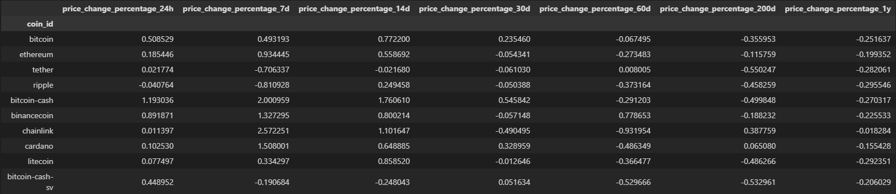
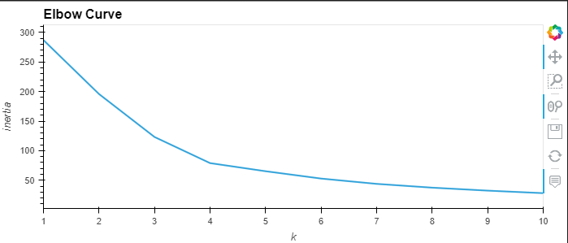
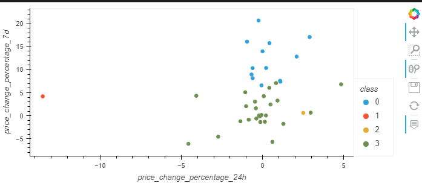

# Crypto Clustering

In order to predict the affect of 24-hour or 7-day price changes on cryptocurrencies, we will use python and unsupervised machine learning. 

## Resources
- [Cryptocurrency Data](Resources/crypto_market_data.csv)

## Data With Original Scaled DataFrame

- DataFrame using StandardScalar

- Elbow Method for Best `k` Value

- Scatter Plot 

## Data with Principal Component Analysis (PCA)
- DataFrame using Principal Component Analysis (PCA)

- PCA Elbow Method for Best `k` Value

- PCA Scatter Plot

## Tools and Technologies
 - Programming Language: Python
 - Libraries: Pandas, hvplot, scikit
 - Data Analysis: Exploratory data analysis, Pandas dataframes, Unsupervised Machine Learning